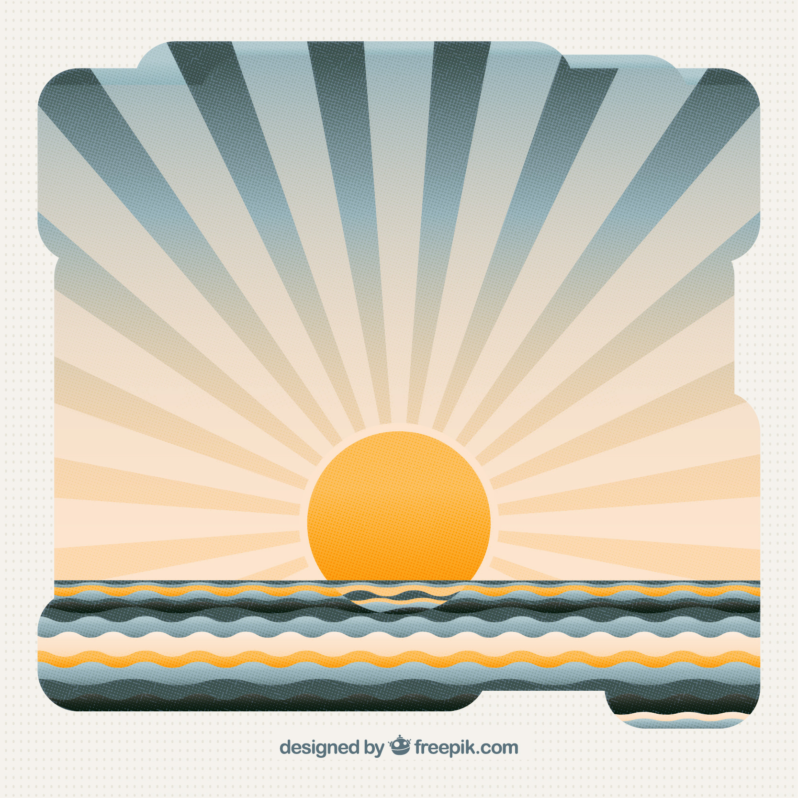

```{r, include = FALSE}
knitr::opts_chunk$set(
  collapse = TRUE,
  comment = "#>"
)
```

## Introduction

So, it’s great to have different functions like `rotator()`, `circle_data()`, and `art_pals()`, but how exactly can these functions help beginners become generative artists? The inspiration behind aRtpack was to provide a way to bring the process of creating generative art data closer to R users who had always wanted to explore generative art but had never fully understood how to make it happen. This vignette is going to serve as an example of how to make a generative art piece with artpack that's a bit more involved that just simple shapes. Note that this isn't meant to serve as a general generative art tutorial, but just a simple showcase of how one might use artpack to create and complete a generative art piece.

### For Beginners

It can be mystifying and a little discouraging to see established generative artists sharing their final pieces, but not necessarily showcasing the process of making it happen behind the scenes in code. This is where artpack can be used. To bridge that gap between the code and data and the beautiful art pieces you can create. By providing users with the actual data needed to create certain geometric shapes, aspiring generative artists can get some great practice with [*"thinking outside of the ggplot grid"*](https://thetidytrekker.com/post/thinking-outside-the-grid/thinking-outside-the-grid) by implementing artpack in their generative art workflow.'

### For Seasoned Artists

artpack is meant to serve as a suite of conveniences functions to be cherry picked and used as they see fit.

The hope is that this vignette is helpful to all who are interested in artpack by seeing it "in action".

### Get Inspired

The first step in creating any art piece is to get inspired! Searching for inspiration on the internet, in real life, or in any other way is a great way to get started. For this vignette, we'll use this free, generic picture of a sun that was found via an internet search:

<center>
{width="500"}
</center>

Note that the goal isn't to copy this image, but more so to pull from it to get a general idea of what we can create for our own image. In this example, let's create a sunset with some waves of water, and a pattern of sun rays coming from the sun. An easy way to think about create art with ggplot is to imagine your building a collage from the layer all the way from the back, to the front.

For this image, let's create five layers:
    - Layer 1 (Bottom): The gradient of colors that represent the sky.
    - Layer 2: The sun rays that are coming from the sun.
    - Layer 3: The sun.
    - Layer 4: The waves of water.
    - Layer 5 (Top): An artistic overlay to give the image some 'depth'.
    
### Creating the Data
#### Layer 1 (The Sky)
To make a gradient we'll need a row of horizontal bars that are assigned different colors. Using ggplot2's `geom_segment()` for this can save on memory (as opposed to creating the bars yourself). `geom_segment()` needs 4 values: `x`, `xend`, `y`, and `yend`. So we'll create a data frame with those data points. We'll use the `art_pals()` function to assign colors to the data we create. We also need to decide how many bars we want to have in the image, but before we do that, let's determine what the size of our canvas will be. To keep things simple let's make our x and y limits the same. `c(0, 100)`.

```{r data-load, message=FALSE, warning=FALSE}
# Library Load in-------
library(artpack)
library(tibble)
library(dplyr)
library(purrr)
library(ggplot2)

# Set canvas size#
x_lim <- c(0, 100)
y_lim <- x_lim

```

Next, let's see if we can get the perfect size bars to create the illusion of a sky gradient. Let's try 100 to start. This means we'll also need 100 colors to apply to each bar. `art_pals()` can be used for this. We'll use the artpack color palette `"beach"` for the sky.

After we have the data frame together, we can start building our ggplot to see how the data is looking on the plot:
```{r sky}
# Sky Specs----
n_sky_bars <- 100
vec_sky_colors <- art_pals("beach", n_sky_bars)
df_sky_bars <-
  tibble(
    x = x_lim[1], # Horizontal bars means the x value is constant
    xend = x_lim[2], # Horizontal bars means the xend values is constant
    y = seq(y_lim[1], y_lim[2], length = n_sky_bars),
    yend = y, # Horizontal bars means yend is the same as y
    color = vec_sky_colors
  )

# Start the ggplot
df_sky_bars |>
  ggplot(aes(x,y)) +
  geom_segment(
    aes(xend = xend, yend = yend),
    color = df_sky_bars$color,
    linewidth = 2
    )

```

#### Layer 2 (The Sun Rays)
For this layer, we're going to make 1 triangle that will originate from the center of the sun. This will require a little bit of manual work, but after we have one triangle, we can easily iterate and rotate it to create the sun rays if we know how many rays we want:

```{r sun_rays}
# Sun rays Specs----
n_sun_rays <- 50
# The rays angles
vec_ray_angles <- seq(0,-180, length = n_sun_rays)
# The ray groups
vec_ray_groups <- group_numbers(vec_ray_angles, prefix = "ray", sep = "_")
# The fill colors
vec_ray_fills <- rep_along(vec_ray_groups, c("#F5E0CD", NA))
# Data for One sun ray
# using a tribble for manual shapes can be helpful to keep the correct coords together
df_sun_ray <-
  tribble(
    ~x, ~y,
    50, 0, # Where the center of the sun will be
    -100, 0,
    -100, 10,
    50, 0
  )

lst_ray_opts <-
  list(
    vec_ray_angles,
    vec_ray_groups,
    vec_ray_fills
  )

df_sun_rays <-
  pmap(lst_ray_opts,
       ~df_sun_ray |>
         rotator(x, y, angle = ..1, anchor = "right") |>
         mutate(
           group = ..2,
           fill = ..3
         )
  ) |>
  list_rbind()


# Add to the plot
df_sky_bars |>
  ggplot(aes(x,y)) +
  geom_segment(
    aes(xend = xend, yend = yend),
    color = df_sky_bars$color,
    linewidth = 2
    ) +
  geom_polygon(data = df_sun_rays, aes(group = group), fill = df_sun_rays$fill, alpha = .3)+
  coord_equal(xlim = x_lim, ylim = y_lim, expand = FALSE)

```
